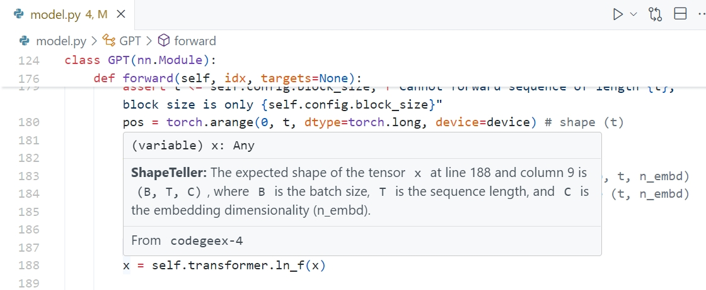
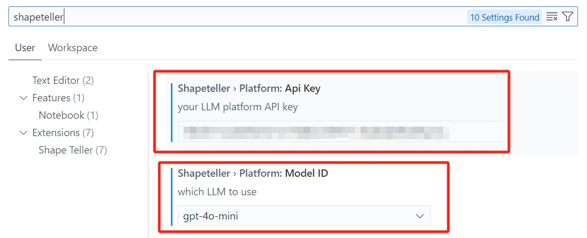
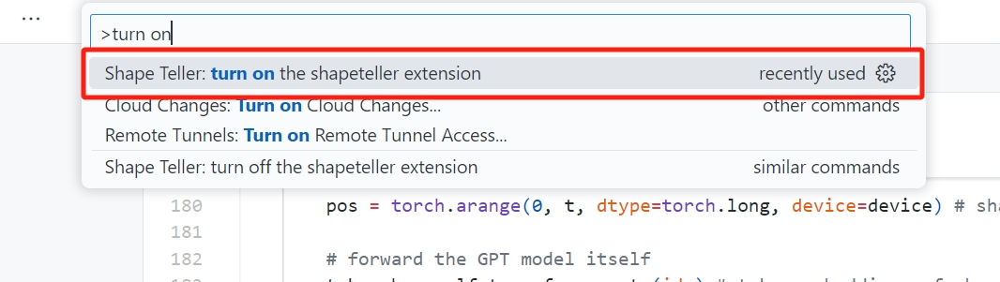
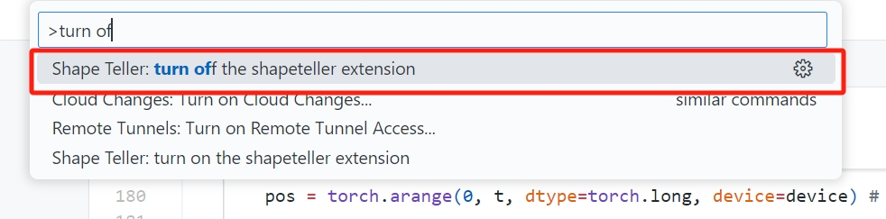
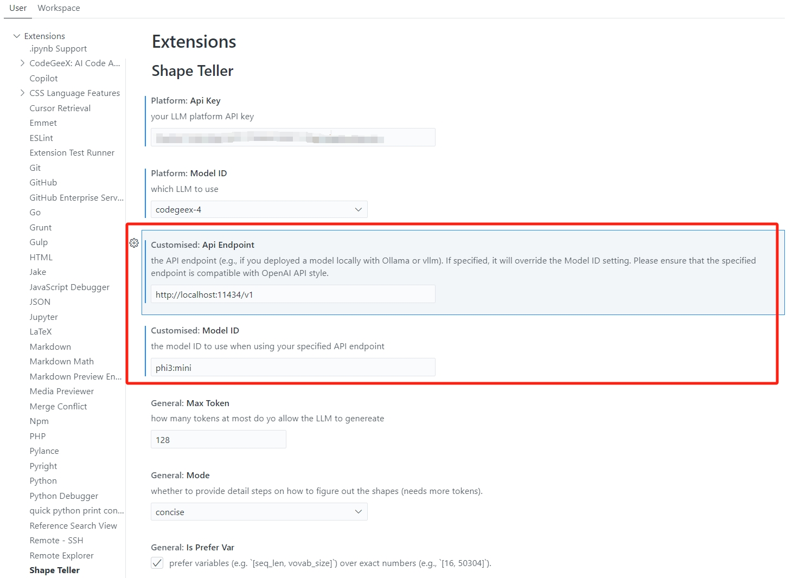

# ShapeTeller

An LLM-powered vscode extension that **tells the shape of arrays and tensors** when hovering over a python variable. 

> [!CAUTION] 
> Since we make use of LLMs, the resulting shapes may not be accurate due to the inherent problem of [hallucination](https://en.wikipedia.org/wiki/Hallucination_(artificial_intelligence)). If you feel doubtful about the result, or want to be 100% accurate, you'd better run the code and print the shapes.

## Installation

Install from [VScode Extension Marketplace](https://marketplace.visualstudio.com/items?itemName=ruiqizhu-ricky.shapeteller)

## How to use

**Step 1**: choose your favorite platform and model (`shapeteller.platform.modelId`) and set the API key (`shapeteller.platform.apiKey`).

**Step 2**: Turn on the extension when you want to use from the command palette by typing `shapeteller: turn on`.

**Step 3**: Hover over a tensor/array variable to see its shape.

**Step 4**: Turn off the extension when you don't want to use it from the command palette by typing `shapeteller: turn off`, avoiding unnecessary API calls.

### Use your own LLM

If you deployed your own model using [Ollama](https://github.com/ollama/ollama) or [vllm](https://github.com/vllm-project/vllm), *which support OpenAI-compatible API*, then you can use it as well. Just set the `shapeteller.customised.modelId` and `shapeteller.customised.apiENdpoint` in the settings. For example, if you run Ollama to serve a `phi3:mini` model:

### General Settings

There are some more general settings, see the screenshot above.

## Credits

- Idea directly brought by [@msaroufim](https://github.com/msaroufim/vscode-pytorch-extension)'s PyTorch extension.
- Extension icon created by <a href="https://www.flaticon.com/free-icons/matrix" title="matrix icons">Nadiinko - Flaticon</a>
