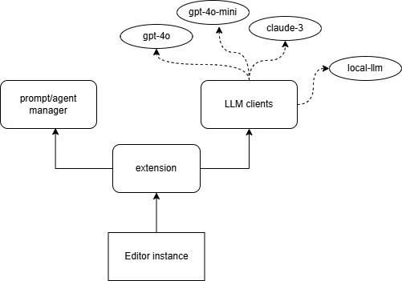

# Design Doc

## Background

I found that the most error-prone and confusing aspect in programming neural networks is getting the shape of a tensor wrong, leading to an error like `RuntimeError: mat1 and mat2 shapes cannot be multiplied`. I've always wanted a tool that could tell/remind me the shape of each tensor **instantly** while I'm writing the code, without having to run the program and print the shapes. I'm not the only one struggling with this issue. Someone even [posted on X](https://twitter.com/Algomancer/status/1763024972623249572), but none of the replies under that post were satisfied.


After a while of web search, I noticed an extension [msaroufim/vscode-pytorch-extension](https://github.com/msaroufim/vscode-pytorch-extension), developed in May 2023, which feeds the source code to GPT and ask it for the shape of a tensor variable. That's exactly what I want, but it only supports the davinci-text-003 model, and it is no longer being updated and maintained. Therefore, I plan to redevelop it based on this plugin.

## Goals
The ultimate goal of this project is simple:
- Hover the mouse over a tensor variable and get the shape of it, by asking an LLM.

Other goals are:
- Support various LLM platforms and models.
- Consice mode vs Detailed mode: only give the shapes vs explain how the shapes are inferred.
- Identify relevant dependent code pieces and doc paragraphs, and submit them to the LLM as reference materials.
- An interactive popup window for users to send further instructions, if the user feel not satisfied with the output.


## Design



- The `estension` is the core component and entry point, also do some house keeping work
- The `LLM client` component should communicate with remote API or locally deployed models. It should be able to send a request to the LLM and get the response. It defines an interface like
  ```typescript
  interface ILLMClient {
    getModelId(): string;  // e.g. "gpt-3.5-turbo"
    getCompletion(prompt: string, maxToken: number): Promise<string|null>;
  }
  ```
- The `Prompt/Agent manager` component is responsible for generating prompts from complex templates with relevant code and docs. It defines an interface like
  ```typescript
  interface IPromptManager {
    getPrompt(code: string, pos: Position, docs: Array<string>|null, moreCode: Array<string>|null): string;
  }
  ```   


## Alternative Solutions

- [jaxtyping](https://github.com/google/jaxtyping): Type annotations and runtime type-checking for shape and dtype of JAX arrays, as well as PyTorch, NumPy, and TensorFlow. This is great and I am going to adopt it in my projects. It demand us to annotate the shape of each tensor manually, which may cost a little bit labour. But it will pay-off in the long run. What's more, `jaxtyping` and LLMs can be used together and the existing annotations definitely will help the LLM to better "infer" the shapes of new tensors.
- [PyTea](https://github.com/ropas/pytea): An automatic static analyser PyTea that detects tensor-shape errors in PyTorch code. The functionality looks cool but it hasn't been maintained for a long time. The outputs of the analyser also seem too sophiscated, way more than what I want.